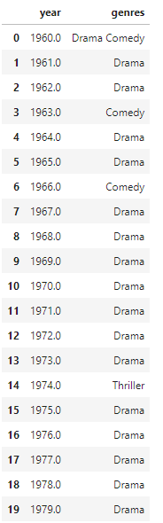
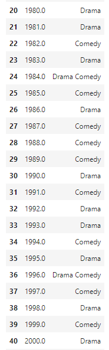
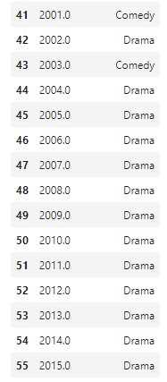

  

<h3 align="center"><a href='https://www.udacity.com/course/data-analyst-nanodegree--nd002'> Udacity Data Analyst Degree </a></h3>
<h4 align="center">Project 1: Investigate a Dataset</h4>

### Table of Contents

- [Installation](#installation)
- [Project Motivation](#motivation)
- [Project Overview](#project_overview)
  - [Choose Your Data Set](#cyds)
  - [Get Organized](#go)
  - [Analyze Your Data](#ad)
  - [Share Your Findings](#sf)
- [Submission](#sb)
- [Results](#results)
- [Conclusions](#conclusion)

## Installation 

You need to be able to work in a Jupyter Notebook on your computer or on Google Colab. The following packages (libraries) need to be installed. You can install these packages via conda or pip.

- Pandas
- Matplotlib
- Seaborn

## Project Motivation 

This is an Udacity Nanodegree project. I was interested in using the TMDb movie data dataset to better understand:  
- Which genres are most popular from year to year?
- What kinds of properties are associated with movies that have high profit?
- Are movie with higher budget profitable?
- Do movie with higher budget recieve better ratings?

In this project we will be analysing the tmdb-movies dataset (tmdb-movies.csv), this data set contains information about 10,000 movies collected from The MovieDatabase (TMDb) with 21 columns fi lled with different informations about themovies. This dataset was assembled to answer most of the questions posed bythe fi lm industry (is there a consistent formula to predict if the movie will besuccessful ?

## Project Overview 
For the final project, you will conduct your own data analysis and create a file to share that documents your findings. You should start by taking a look at your dataset and brainstorming what questions you could answer using it. Then you should use pandas and NumPy to answer the questions you are most interested in, and create a report sharing the answers. You will not be required to use inferential statistics or machine learning to complete this project, but you should make it clear in your communications that your findings are tentative. This project is open-ended in that we are not looking for one right answer.

### Step One - Choose Your Data Set 

Click this [link](https://s3.amazonaws.com/video.udacity-data.com/topher/2018/July/5b57919a_data-set-options/data-set-options.pdf) (available in a Google doc [here](https://docs.google.com/document/d/e/2PACX-1vTlVmknRRnfy_4eTrjw5hYGaiQim5ctr9naaRd4V9du2B5bxpd8FEH3KtDgp8qVekw7Cj1GLk1IXdZi/pub?embedded=True)) to open a document with links and information about data sets that you can investigate for this project. You <strong>must</strong> choose one of these datasets to complete the project.

### Step Two - Get Organized 

Eventually you’ll want to submit your project (and share it with friends, family, and employers). Get organized before you begin. We recommend creating a single folder that will eventually contain:
<ul>
    <li>The <strong>report</strong> communicating your findings</li>
    <li>Any <strong>Python code</strong> you wrote as part of your analysis</li>
    <li>The <strong>data set</strong> you used (which you will not need to submit)</li>
</ul>
You may wish to use a Jupyter notebook, in which case you can submit both the code you wrote and the report of your findings in the same document. Otherwise, you will need to submit your report and code separately. If you would like a <strong>notebook template</strong> to help organize your investigation, you can click <a href="https://s3.amazonaws.com/video.udacity-data.com/topher/2018/April/5ac7a08a_investigate-a-dataset-template.ipynb/investigate-a-dataset-template.ipynb.zip">here</a>. Or there may be a page in the project here called Project Workspace: Complete and Submit Project, where you can do all your work and submit the project.

### Step Three - Analyze Your Data 

Brainstorm some questions you could answer using the data set you chose, then start answering those questions. You can find some questions in the [data set options](https://s3.amazonaws.com/video.udacity-data.com/topher/2018/July/5b57919a_data-set-options/data-set-options.pdf) to help you get started.

Try and suggest questions that promote looking at relationships between multiple variables. You should aim to analyze at least one dependent variable and three independent variables in your investigation. Make sure you use NumPy and pandas where they are appropriate!

### Step Four - Share Your Findings

Once you have finished analyzing the data, create a report that shares the findings you found most interesting. If you use a Jupyter notebook, share your findings alongside the code you used to perform the analysis. Make sure that your report text is contained in Markdown cells to clearly distinguish your comments and findings from your code work. You should also feel free to use other tools and software to craft your final report, but make sure that you can submit your report as an HTML or PDF file so that it can be opened easily.

## Submission 
What to include in your submission
<ul>
   <li>A PDF or HTML file containing your analysis. This file should include:</li>
       <ul>
        <li>A note specifying which dataset you analyzed</li>
        <li>A statement of the question(s) you posed</li>
        <li>A description of what you did to investigate those questions</li>
        <li>Documentation of any data wrangling you did</li>
        <li>Summary statistics and plots communicating your final results</li>
       </ul>
   <li>Code you used to perform your analysis. If you used a Jupyter notebook, you can submit your .ipynb. Otherwise, you should submit the code separately in .py file(s).</li>
   <li>A list of Web sites, books, forums, blog posts, github repositories, etc. that you referred to or used in creating your submission (add N/A if you did not use any such resources).</li>
</ul>

## Results 
- Which genres are most popular from year to year? 

    
    
    

From the dataframe above we can see each year with it respective best genres of the year.

- What kinds of properties are associated with movies that have high profit? 

    
    

We arrive to the conclusion that :

* the most profitable films are popular
* the non profitable films have lower budget than the profitable movies
* the runtime is high in the nonprofitable film (after the year 1970 in the plot because of a short dataset)
* the votes are higher for the profitable movies
we can tell that popularity, budget, vote_average play a role in the profitability of the film.

- Are movies with higher budget profitable? 

    

we conclude that the non-profitable movies have higher average budgets.

- Do movies with higher budget recieve better ratings? 

    

we see that movies with higher budget recieves an average rating almost equal to movies with low budget.

## Conclusions 
During this analysis of this dataset we have arrived to a better understanding of what makes a movie have a high chance of it being profitable. here we present our findings:

* As we saw in our first question (Which genres are most popular from year to year?) that the drama genres is present as the most popular genre from year to year
* for the seconde question (What kinds of properties are associated with movies that have high revenues?) we found that usally movies with higher runtime are non_profitable, votes and popularity of the movies indicates its profitability and profitable movie usually have a higher budget
* in the third question (Are movie with higher budget profitable?) we found that no, a higher budget doesn't mean the movie will be profitable.
* Do movie with higher budget recieve better rating? we saw that the movies with higher budget recieve the same rating as the low budget ones on average

to summarize our findings, if you want a profitable movie we need to create a drama movie with a high budget and a small runtime (this is the secret formula that we arrived to).

In this analysis we faced some limitation which are:
* The missing data (in the form of Nan values or 0.0.
* the dataset isn't diverse enough in the genres(almost every movie is in the drama genre).
* the size of the dataset (10866) isn't enough to find the ultimate secret formula to produce a garantied profitable movie.
